# Recipe Explorer App

A modern recipe discovery application that allows users to browse and explore various recipes from different cuisines. Built with Next.js and TypeScript, this app provides a responsive and interactive user experience with features like recipe search, filtering, and detailed recipe views.

[Giuliano De Ioanni](mailto:giulianodeioannigcp@gmail.com)

## Proposed Solution

I've built a responsive recipe exploration application with the following key features and implementation details:

### Core Features
- **Recipe Browsing**: View popular recipes in an attractive grid layout
- **Responsive Design**: Fully responsive layout that works on all device sizes
- **Performance Optimized**: Implemented code splitting, image optimization, and efficient data fetching
- **Type Safety**: Built with TypeScript for better developer experience and code reliability

### Technical Implementation
- **Frontend Framework**: Next.js 13+ with App Router for server-side rendering
- **Styling**: Tailwind CSS for utility-first styling
- **State Management**: React hooks for local state management
- **Data Fetching**: Custom React hooks with localStorage caching for better performance
- **Accessibility**: Built with ARIA labels and semantic HTML for better accessibility

### Key Components
- `RecipeGridList`: Displays recipes in a responsive grid layout
- `RecipeGridItem`: Individual recipe card component with hover effects
- `PopularRecipesGrid`: Shows trending recipes with caching
- Custom hooks for data fetching and state management

## Live Demo

[View Live Demo](https://your-deployed-app-url.vercel.app)

## Screenshots

| [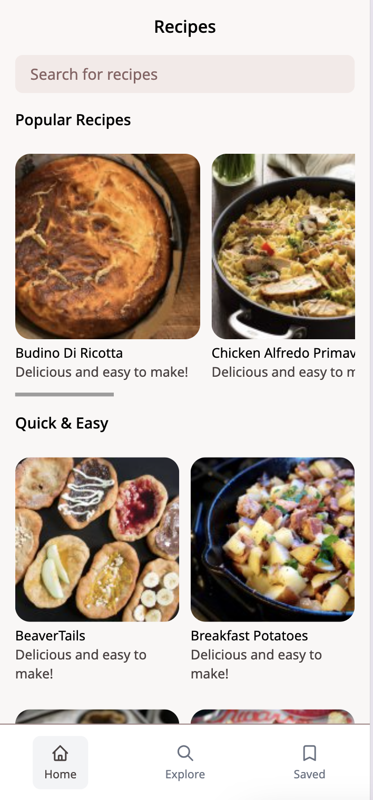](docs/screenshot1.png) | [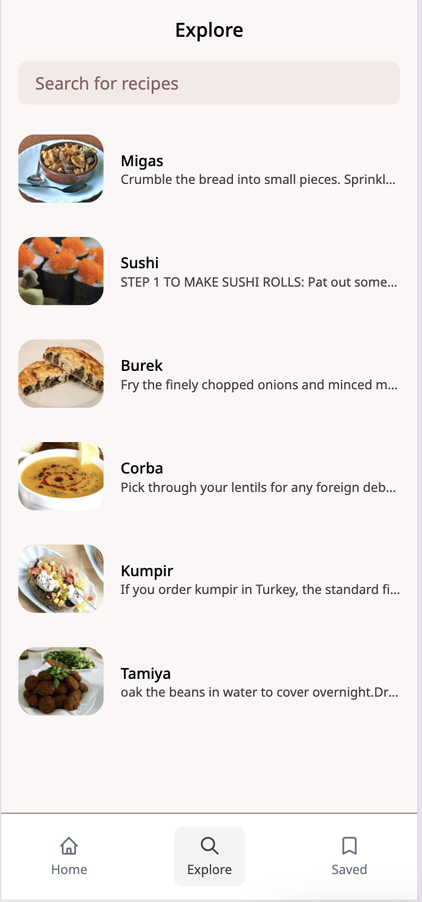](docs/screenshot2.png) | [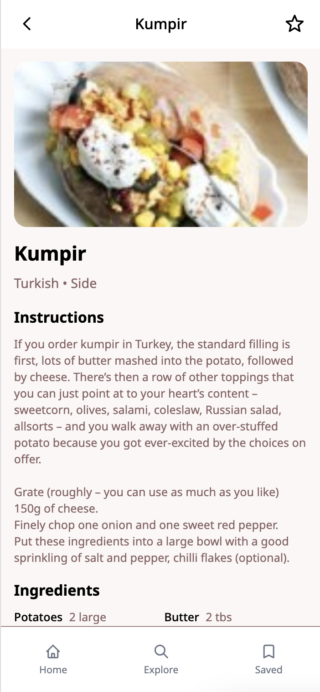](docs/screenshot3.png) |
|:---:|:---:|:---:|
| *Home Page* | *Search Results* | *Recipe Details* |

## Assumptions

- The application uses TheMealDB API as the data source
- Basic knowledge of recipe structure (ingredients, instructions, etc.) is assumed
- Responsive design targets mobile, tablet, and desktop breakpoints
- Browser compatibility with modern JavaScript features is assumed

## Libraries & Tools Used

- **Framework**: Next.js 13+
- **Language**: TypeScript
- **Styling**: Tailwind CSS
- **Icons**: React Icons
- **Linting**: ESLint with TypeScript support
- **Formatting**: Prettier
- **State Management**: React Hooks
- **HTTP Client**: Built-in fetch API

## Setup

1. Clone the repository:
   ```bash
   git clone https://github.com/svighenaitz/prima-take-home.git
   cd prima-take-home
   ```

2. Install dependencies:
   ```bash
   bun install
   ```

3. Create a `.env.local` file in the root directory and add the following environment variable:
   ```bash
   # .env.local
   NEXT_PUBLIC_API_URL=https://www.themealdb.com/api/json/v1/1
   ```
   
   This will make the API URL available in your application.

4. Run the development server:
   ```bash
   bun run dev
   ```

5. Open [http://localhost:3000](http://localhost:3000) in your browser

## Running Tests

To run the test suite:

```bash
bun run test
```

### Test Results

<div style="display: grid; grid-template-columns: repeat(2, 1fr); gap: 1rem; align-items: stretch; justify-content: center;">
  <div style="display: flex; flex-direction: column;">
    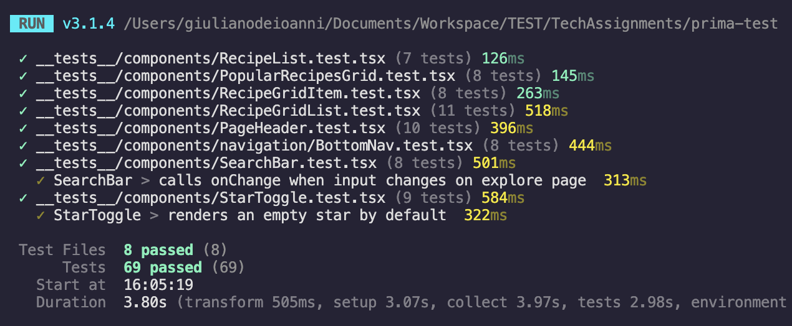
    <p style="text-align: center; margin-top: 0.5rem; color: #6b7280;">Test Execution Results</p>
  </div>
  <div style="display: flex; flex-direction: column;">
    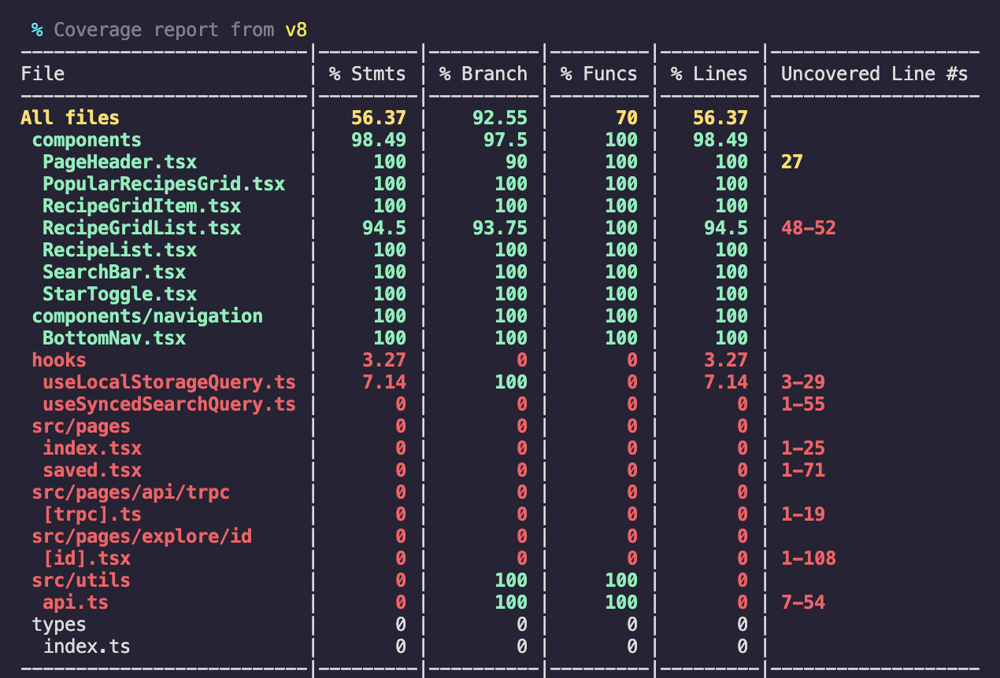
    <p style="text-align: center; margin-top: 0.5rem; color: #6b7280;">Code Coverage Report</p>
  </div>
</div>

To run end-to-end tests, use the following command:

```bash
bun run test:e2e
```

Make sure the development server is running in another terminal before executing the end-to-end tests.

## Lighthouse Results

### Performance Audits

| [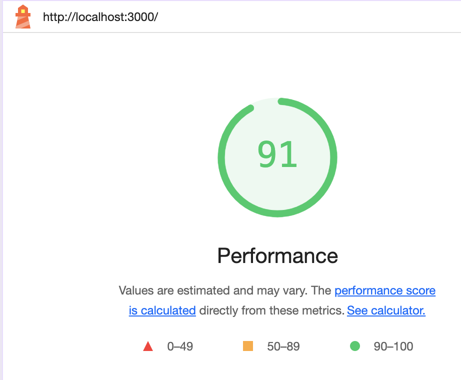](docs/lighthouse/home.png) | [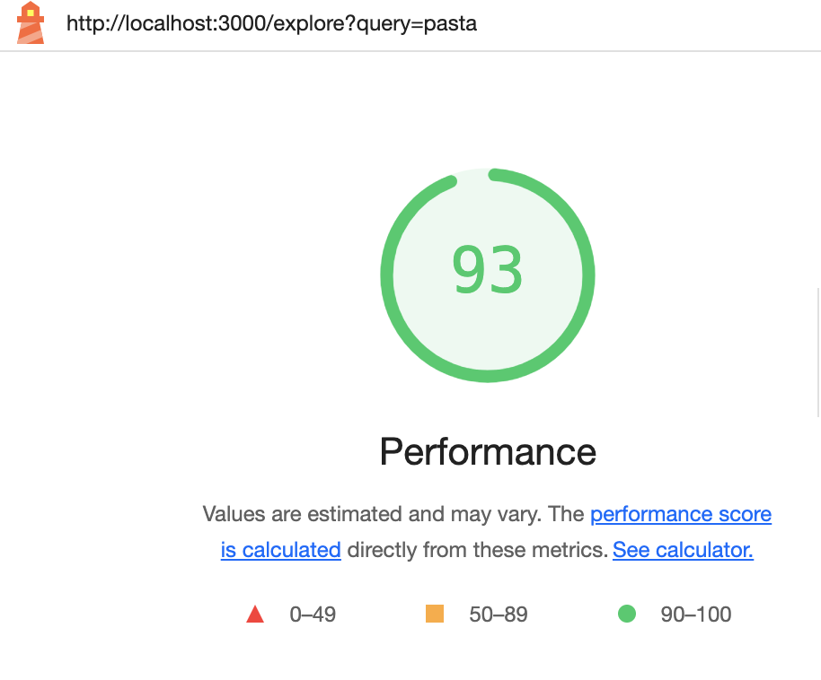](docs/lighthouse/search.png) |
|:---:|:---:|
| *Home Page* | *Search Results* |
| [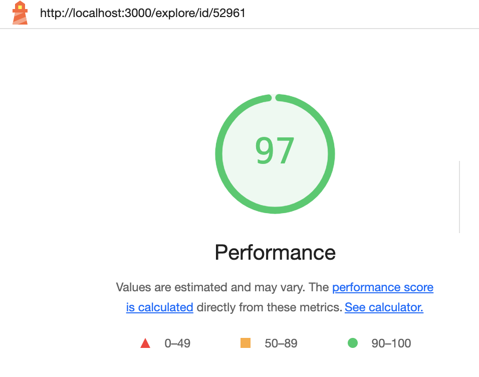](docs/lighthouse/details.png) | [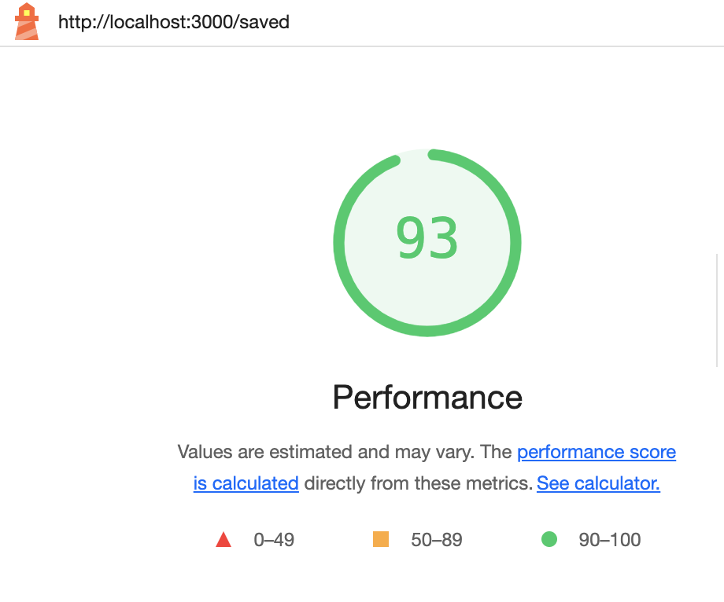](docs/lighthouse/saved.png) |
| *Recipe Details* | *Saved Recipes* |

### Accessibility Audits

| [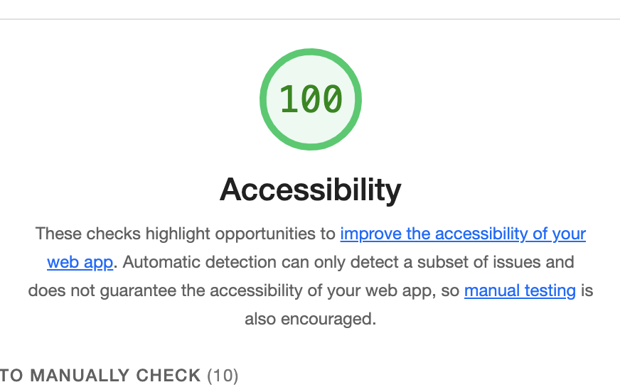](docs/lighthouse/a11y-home-saved.png) | [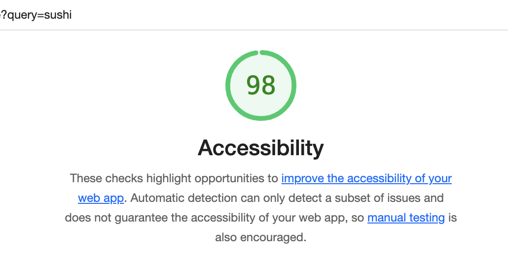](docs/lighthouse/a11y-details.png) |
|:---:|:---:|
| *Home & Saved Recipes* | *Recipe Details* |

## Future Work

1. **Testing**
   - Add visual regression testing

2. **Performance**
   - Implement service worker for offline support
   - Add more aggressive caching strategies


3. **Features**
   - User authentication and saved recipes
   - Advanced search and filtering
   - Recipe rating and reviews
   - Meal planning functionality

4. **Accessibility**
   - Improve keyboard navigation
   - Add more ARIA labels and roles
   - Conduct accessibility audit

5. **Internationalization**
   - Add multi-language support
   - Localize dates and numbers
   - RTL language support

6. **Documentation**
   - Add Storybook for component documentation
   - Improve API documentation
   - Add contribution guidelines

## License

This project is licensed under the MIT License - see the [LICENSE](LICENSE) file for details.